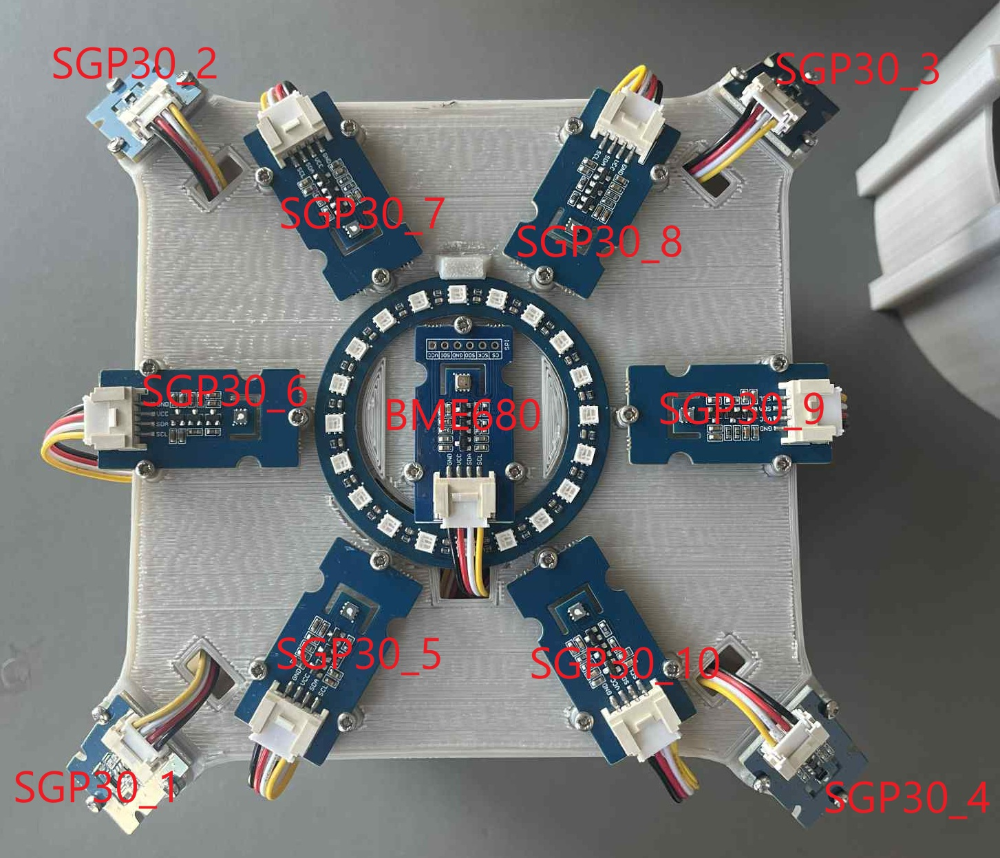

# Directional_eNose

## Description

The Directional eNose is an electronic nose system designed to detect and identify the direction of odors and chemical substances in the environment. The system uses multiple SGP30 air quality sensors arranged in a circular pattern to detect CO2 and TVOC (Total Volatile Organic Compounds) concentrations from different directions. It has the functionality of being able to detect where a smell is coming from and display the direction using an LED ring as indicator. In addition to that it has a BME680 and 6 functionalised gas sensors used for detecting the type of odor.

The main program (`eNose_Program.py`) continuously monitors all sensors and environmental conditions, providing real-time data on air quality measurements and environmental parameters. In addition to directional detection, the program can identify specific smells using a machine learning model generated with Edge Impulse. By loading a `.eim` model file, the system classifies odors in real time based on sensor data and displays the detected smell on the GUI. The program also features a graphical interface for live feedback and supports safe shutdown and control via the hardware buttons on the display.

## Hardware Components

- **10x SGP30 Air Quality Sensors** - CO2 and TVOC detection
- **1x BME680 Environmental Sensor** - Temperature, humidity, pressure, and gas resistance
- **2x TCA9548A I2C Multiplexers** - Managing multiple sensors with same I2C address
- **1x WS2813 RGB LED Ring (20 LEDs)** - Directional indication display
- **Raspberry Pi 4 with Grove Base Hat** - Main processing unit
- **Adafruit PiTFT Plus 320x240 2.8" TFT** - Display for the GUI + 2 buttons

## Device I2C Addresses

| Device | Address | Notes |
|--------|---------|-------|
| SGP30 | 0x58 | All sensors (managed via multiplexers) |
| BME680 | 0x76 | Default address |
| TCA9548A | 0x70 | Primary multiplexer |
| TCA9548A | 0x71 | Secondary multiplexer (A0 shorted) |

## Hardware Setup Instructions

1. **Initial Positioning**: First make sure the top cover is positioned in such way that the BME680 port points towards you. Do not screw the top cover in place yet.

2. **Outer SGP30 Sensors**: Connect the 4 outer SGP30 sensors starting from bottom left, going clockwise to IC0-IC3 of the MUX with a default address 0x70.

3. **Inner SGP30 Sensors**: Connect the inner 6 SGP30 sensors starting from bottom left, going clockwise to IC4-IC7 on the MUX with the default address and the rest to IC0-IC1 on the MUX with address 0x71 respectively.

4. **BME680 and LED Ring**: Connect the BME680 to any open I2C port on the eNose. Connect the RGB ring GND to any ground pin on the base hat Raspberry Pi extension board, power to the 5V power supply pin and the SIG pin to GPIO 12 (pin 32 on the Raspberry Pi header).

5. **Display**: The display uses the hardware SPI pins (SCK, MOSI, MISO, CE0, CE1) as well as GPIO
#25 and #24. GPIO #17 and #27 are used for two of the 4 buttons on the display, one of which serves as a button to turn off the Raspberry Pi. All pins can be connected using female-to-female jumper cables from the display directly to the pins of the base hat apart from the power input, which is taken directly from the 5V power supply.

6. **Final Assembly**: You can now screw the top cover in place.



## Data Collection Setup

### CSV Data Collection Order

The `csv_data_collecting.py` script collects sensor data in the following specific order:

**BME680 Environmental Data (3 readings):**
1. Temperature (°C)
2. Humidity (%RH)
3. Gas Resistance (Ohms)

**SGP30 Gas Sensor Data (12 readings from sensors 5-10):**
4. SGP30_5_CO2 (ppm)
5. SGP30_5_TVOC (ppb)
6. SGP30_6_CO2 (ppm)
7. SGP30_6_TVOC (ppb)
8. SGP30_7_CO2 (ppm)
9. SGP30_7_TVOC (ppb)
10. SGP30_8_CO2 (ppm)
11. SGP30_8_TVOC (ppb)
12. SGP30_9_CO2 (ppm)
13. SGP30_9_TVOC (ppb)
14. SGP30_10_CO2 (ppm)
15. SGP30_10_TVOC (ppb)

This order ensures consistent data formatting for machine learning model training and inference.

## Machine Learning Model Deployment

### Deploying Edge Impulse Model

To deploy your trained machine learning model from Edge Impulse:

1. **Select Deployment Target**: 
   - Go to **Deployment** options in your Edge Impulse project
   - Choose **"Linux (ARMv7)"** as the deployment target
   - Ensure the target device is set to **Raspberry Pi 4**

2. **Build and Download**:
   - Click **Build** to generate the model
   - Download the generated `.eim` file

3. **Install Model**:
   - Place the downloaded `.eim` file in the same directory as `eNose_Program.py`
   - The program will automatically load and use the model for real-time odor classification

## Usage

### Running the Main Program

To start the main GUI application (with optional Edge Impulse model):

```bash
sudo /home/pablo/appenv/bin/python3 /home/pablo/OneNose_Project/eNose_Program.py model.py
```

- If you provide a `.eim` file, the program will use it for real-time odor classification.
- If no model is provided, the program will run in sensor-only mode.

### Running the Data Collection Script

To collect training data for machine learning:

```bash
/home/pablo/appenv/bin/python3 /home/pablo/OneNose_Project/Data_Collection/csv_data_collecting.py
```

**How it works:**
- The script will prompt you to enter a label for the data (e.g., the odor or condition being measured).
- It will then generate CSV files with 10 readings per file from each sensor. It will continuously generate files with new readings until you prompt it to stop.
- You can type `stop` to finish the current file after the current set of 10 readings and start new readings with a new label, or `exit` to finish the current readings and stop the script.
- Each file is saved in the `Data/` directory with a timestamp and label in the filename.

**Example CSV output:**

```
timestamp,BME680_temp,BME680_humidity,BME680_gas,SGP30_5_CO2,SGP30_5_TVOC,SGP30_6_CO2,SGP30_6_TVOC,SGP30_7_CO2,SGP30_7_TVOC,SGP30_8_CO2,SGP30_8_TVOC,SGP30_9_CO2,SGP30_9_TVOC,SGP30_10_CO2,SGP30_10_TVOC
0,32.11,34.53,49268.19,400,339,7983,4989,36654,17858,57330,54946,57330,57630,9512,6980
1000,32.12,34.51,48556.74,400,324,6923,4738,36923,18346,57330,55399,57330,57142,9373,6915
2000,32.13,34.51,47702.57,400,317,5609,4277,37251,19008,57330,54667,57330,57734,9547,7025
3000,32.14,34.53,46490.36,400,389,5325,4242,38653,20019,57330,53795,57330,58292,10323,7644
4000,32.15,34.53,44664.33,574,578,5939,4452,40354,21587,57330,52087,57330,59024,11070,8139
5000,32.15,34.57,42242.79,1156,950,6877,4803,42263,22528,57330,50833,57330,59303,11325,8308
6001,32.16,34.63,39248.0,1684,1227,7896,5089,43248,23539,57330,46719,57330,59442,11354,8387
7001,32.17,34.68,36777.88,2064,1607,8887,5440,43904,23505,57330,43094,57330,60000,11528,8545
8001,32.18,34.77,34374.13,2607,1910,9773,5736,43934,23853,57330,41874,57330,60000,12442,9006
9001,32.19,34.87,32691.5,3122,2193,10925,6157,42383,23016,57330,40689,57330,60000,14192,9749
```

**Tips:**
- Ensure the sensor readings and files are generated properly after starting the script for the first time. For example, look for corrupt/empty readings or improperly generated CSV file.
- Use consistent labeling to prevent having to alter the file names later due to mistakes. For example, try not to accidentally switch the label chocolateicecream with chocoicecream later (yes, it happened :D).

### Stopping the Main Program

- Use the shutdown button on the side of the display to safely power off the Raspberry Pi before cutting the power.

## Repository Structure

The main files and folders in this repository are:

- `eNose_Program.py` — Main application with GUI, sensor reading, and ML inference
- `enose_functions.py` — Utility functions for normalization, LED control, etc.
- `Assets/` — Images, datasheets, old data, supplementary info regarding setup
- `Data_Collection/`
    - `csv_data_collecting.py` — Script for collecting labeled sensor data for ML
    - `Data/` — Collected CSV data files for training
- `Other_Scripts/` — Additional scripts for testing, diagnostics, or hardware setup
    - `RGB_ring_simple.py`, `RGB_ring.py` — LED ring test scripts
    - `simple_BME680_readings.py`, `simple_sgp30_readings.py` — Sensor test scripts
    - `TCAdevice_scan.py` — I2C multiplexer scan utility

## Contact

For questions, suggestions, or support, please contact:

**Ventsislav Ivanov**
ventsislav@mci.sdu.dk